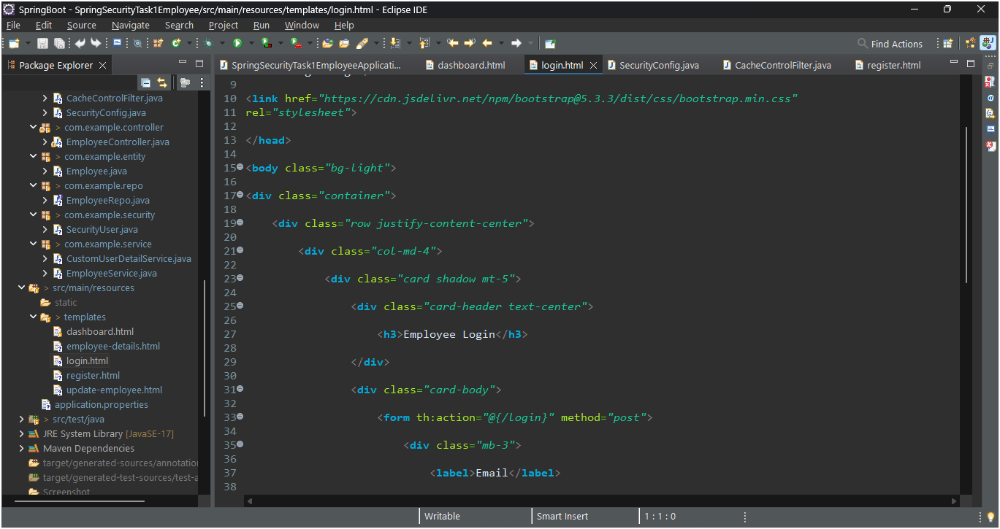
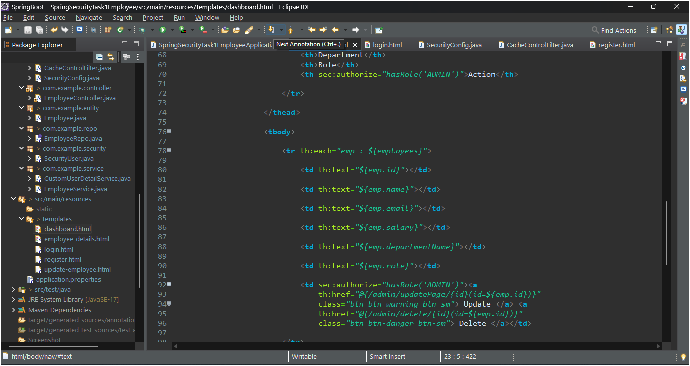
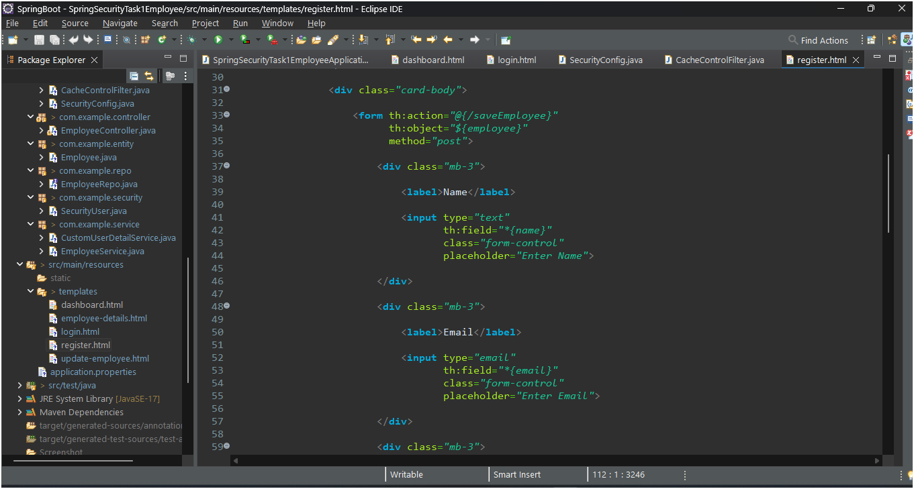
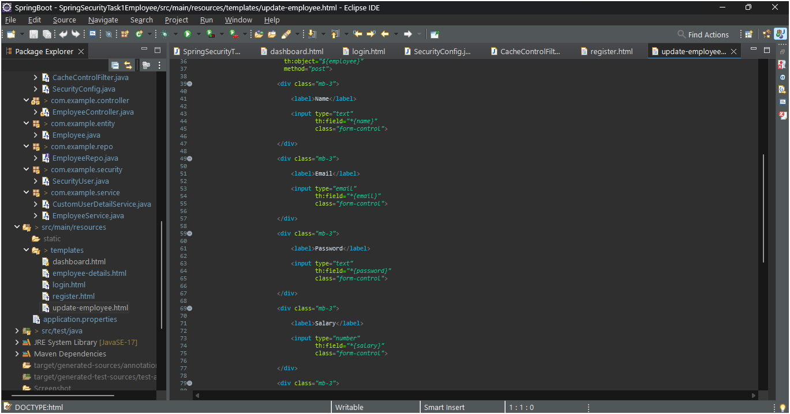

# 🚀 Employee Management System


---

## 📌 Overview

A secure and dynamic Employee Management System built using Spring Boot, Spring Security, Thymeleaf, and MySQL.

This project provides:

* Authentication & Authorization
* Employee Management
* Role-Based Access Control
* Dashboard Management
* Employee Update/Delete Operations
* Secure Login & Logout System

---

# ✨ Features

* Secure Login & Logout
* Employee Registration
* Role-Based Authentication
* BCrypt Password Encryption
* Employee Dashboard
* Add Employees
* Update Employee Details
* Delete Employees
* Thymeleaf Frontend
* MySQL Database Integration
* Session Handling
* Cache Protection After Logout

---

# 🛠️ Tech Stack

| Technology      | Usage                          |
| --------------- | ------------------------------ |
| Java            | Backend Language               |
| Spring Boot     | Application Framework          |
| Spring Security | Authentication & Authorization |
| Spring Data JPA | Database Operations            |
| MySQL           | Database                       |
| Thymeleaf       | Frontend Template Engine       |
| Bootstrap       | UI Design                      |
| Hibernate       | ORM                            |
| Maven           | Dependency Management          |

---

# 👥 User Roles

## ADMIN

* View all employees
* Update employee details
* Delete employees

## USER

* View dashboard
* View employee details

---

# 🔐 Security Features

* BCrypt Password Encoding
* Session Invalidation on Logout
* Browser Cache Protection
* Role-Based Authorization
* Secure Authentication Flow

---

# 🌐 Live Demo

## Render Deployment

https://employeemanagement-byusing-basicauth-1.onrender.com

---

# 📂 GitHub Repository

## GitHub Link

https://github.com/Bhawana-A/EmployeeManagement_ByUsing_BasicAuth

---

# 📸 Application Screenshots

## Login Page



---

## Employee Dashboard



---

## Employee Registration



---

## Update Employee



---

# 📁 Project Structure

```bash id="zqvzxh"
src/main/java/com/example
│
├── config
├── controller
├── entity
├── repo
├── security
└── service
```

---

# 🗄️ Database

* MySQL Database
* Hibernate ORM
* Spring Data JPA

---

# 🎨 Frontend

* Thymeleaf Templates
* Bootstrap UI
* Responsive Design

---

# 📚 Learning Outcomes

* Spring Boot Development
* Spring Security Authentication
* Authorization & Roles
* CRUD Operations
* MVC Architecture
* Database Connectivity
* Session Management
* Secure Web Application Development

---

# 👩‍💻 Author

## Bhawana Ahirwar

Passionate Java & Spring Boot Developer 🚀
